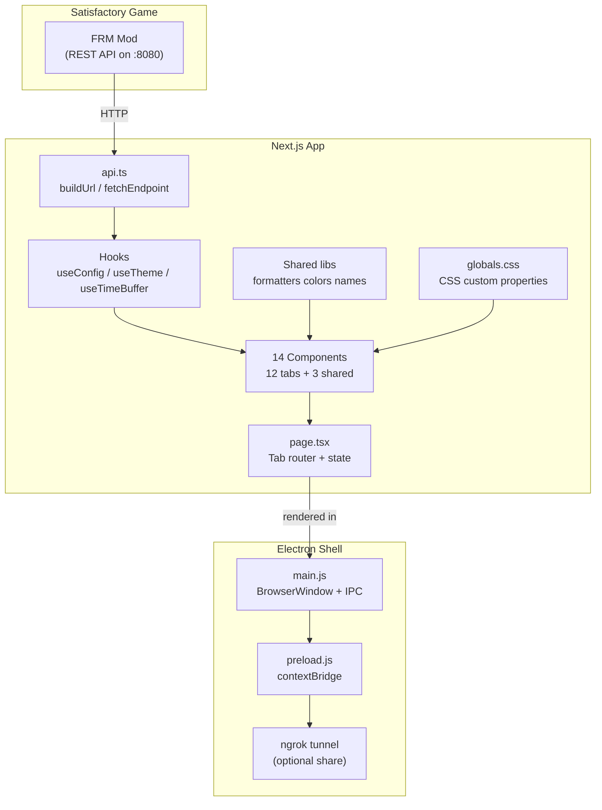

# Architecture

## Overview

Statusfactory is a **Next.js 15 + Electron 33 desktop application** that monitors Satisfactory factory statistics in real-time via the **Ficsit Remote Monitoring (FRM)** mod API. It renders as a single-page dashboard with 12 tabbed views, each polling specific FRM REST endpoints.



---

## Tech Stack

| Layer              | Technology                           | Version   |
| ------------------ | ------------------------------------ | --------- |
| Frontend Framework | Next.js (static export)              | 15.x      |
| UI Library         | React                                | 19.x      |
| Language           | TypeScript (strict mode)             | 5.x       |
| Styling            | Tailwind CSS + CSS custom properties | 3.4       |
| Desktop Shell      | Electron                             | 33.x      |
| Packaging          | electron-builder                     | 25.x      |
| Tunneling          | ngrok                                | 5.x beta  |
| Dev orchestration  | concurrently + wait-on               | 9.x / 8.x |

---

## Build Pipeline

### Development

```
npm run dev               → Next.js dev server on :3000
npm run electron:dev      → concurrently:
                              1. next dev (port 3000)
                              2. wait-on :3000 → electron . --dev
```

In dev mode, Electron loads `http://localhost:3000` with HMR and DevTools open. Retries up to 10 times if the server isn't ready.

### Production Build

```
npm run build             → next build (static export → out/)
npm run electron:build    → next build → electron-builder → dist/
```

The Next.js config sets `output: "export"` and `assetPrefix: "./"` so the static HTML works via `file://` protocol inside Electron. The builder packages `out/**/*` and `electron/**/*` into platform-specific executables:

- **Windows:** portable `.exe`
- **Linux:** AppImage
- **macOS:** DMG

---

## Data Flow

1. **User enters FRM credentials** → `ConnectionBar` → `useConfig().saveConfig()` → `localStorage`
2. **User clicks Connect** → `testConnection(config)` → `GET /getPower` on FRM API
3. **On success** → `connected = true` → tab content renders
4. **Each dashboard panel** polls relevant endpoints on a `setInterval` matching `config.refreshRate`
5. **`useTimeBuffer`** accumulates timestamped snapshots (max 1 hour) for windowed averaging
6. **`useTheme`** injects CSS custom properties into `document.documentElement` from localStorage or defaults
7. **Fluid detection** — `lib/fluids.ts` uses synchronous ClassName pattern matching (`isFluidClassName()`) to identify liquids and gases directly from production stats; also traces raw materials through the recipe graph

### Connection URL Logic

`buildUrl()` auto-detects the scheme:

- **localhost / 127.0.0.1 / private IPs** → `http://host:port/endpoint`
- **Domain names (ngrok, Cloudflare Tunnel, etc.)** → `https://host/endpoint` (port stripped — tunnels handle port mapping)

### Authentication

If `config.password` is set, every request includes the header `X-FRM-Authorization: <password>`. ngrok-hosted connections also send `ngrok-skip-browser-warning: 1` to bypass the interstitial page on free-tier tunnels.

---

## Directory Structure

```
satisfactoryStats/
├── electron/
│   ├── main.js            # Electron main process, window creation, IPC handlers
│   └── preload.js         # contextBridge exposing tunnel APIs to renderer
├── public/
│   └── Icons/             # PNG icons for buildings/items (referenced by className)
├── src/
│   ├── app/
│   │   ├── globals.css    # CSS custom properties, Tailwind directives, global resets
│   │   ├── layout.tsx     # Next.js root layout (metadata, font loading)
│   │   └── page.tsx       # Main dashboard — tab router, connection state, theme provider
│   ├── components/
│   │   ├── ConnectionBar.tsx
│   │   ├── EndpointList.tsx
│   │   ├── TimeWindowSelector.tsx
│   │   └── dashboard/
│   │       ├── ChatPanel.tsx
│   │       ├── FactoryEfficiency.tsx
│   │       ├── FactoryMap.tsx
    │       ├── FluidDashboard.tsx
    │       ├── GeneratorStatus.tsx
    │       ├── InventoryPanel.tsx
    │       ├── PlayerMap.tsx
    │       ├── PowerDashboard.tsx
    │       ├── ProductionMonitor.tsx
    │       ├── ResourceTracker.tsx
    │       ├── SettingsPanel.tsx
    │       └── TrainControlTower.tsx
    └── lib/
        ├── api.ts          # FRM API client + endpoint registry
        ├── fluids.ts       # Fluid identification + raw material tracing
│       ├── types.ts        # TypeScript type definitions
│       ├── useConfig.ts    # FRM config persistence hook
│       ├── useAppSettings.ts # UI preferences hook
│       ├── useTheme.tsx    # Theme context + CSS variable injection
│       ├── useTimeBuffer.ts # Rolling time-series buffer hook
│       └── electron.d.ts   # Type declarations for window.electronAPI
├── docs/                   # This documentation
├── package.json
├── tsconfig.json
├── next.config.js
├── tailwind.config.js
└── postcss.config.js
```

---

## Key Conventions

- **All interactive components** are `'use client'` (React 19 Client Components).
- **No external state management** — pure React hooks (`useState`, `useContext`, `useCallback`).
- **localStorage** is the persistence layer for config, settings, and theme.
- **Time-series averaging** is handled by `useTimeBuffer` — each panel can average metrics over 1m–1h windows.
- **Theme is CSS custom properties** injected at `:root` level, not Tailwind config or CSS-in-JS.
- **Icons** are PNG files in `public/Icons/` matched by `ClassName` property from FRM responses.
- **Canvas 2D** is used for `FactoryMap` and `TrainControlTower` track map for high-performance rendering.
- **ngrok sharing** is available in the Electron build via IPC — spawns a tunnel process and exposes the public URL.
