# Architecture Overview

This diagram shows the full system architecture of Statusfactory — from the Satisfactory game running the FRM mod, through the Next.js single-page dashboard, to the optional Electron desktop shell and ngrok tunnel for remote sharing.

```mermaid
graph TD
    subgraph "Satisfactory Game"
        GAME["Satisfactory<br/>Game Instance"]
        FRM["Ficsit Remote Monitoring Mod<br/>REST API on :8080<br/>70+ endpoints"]
        GAME --> FRM
    end

    subgraph "Network Layer"
        LOCAL["Local Network<br/>http://host:port"]
        NGROK_TUNNEL["ngrok Tunnel<br/>https://xxxx.ngrok-free.app<br/>optional remote access"]
    end

    subgraph "Next.js App (Static Export)"
        subgraph "Entry Point"
            LAYOUT["layout.tsx<br/>ThemeProvider wrapper<br/>Inter font, global styles"]
            PAGE["page.tsx (Home)<br/>Single-page shell<br/>Connection state machine<br/>Tab router (13 tabs)<br/>Time-window orchestrator"]
            LAYOUT --> PAGE
        end

        subgraph "Connection Layer"
            CONN_BAR["ConnectionBar.tsx<br/>Host / Port / Token inputs<br/>Connect / Disconnect<br/>ngrok tunnel controls"]
        end

        subgraph "Shared Hooks"
            USE_CONFIG["useConfig.ts<br/>FRMConfig persistence<br/>localStorage CRUD"]
            USE_SETTINGS["useAppSettings.ts<br/>AppSettings persistence<br/>partial merge + reset"]
            USE_THEME["useTheme.tsx<br/>ThemeProvider context<br/>CSS custom properties on :root<br/>dark/light mode"]
            TIME_BUFFER["useTimeBuffer.ts<br/>Timestamped rolling buffer<br/>getWindowData / getWindowAverage<br/>1-hour max retention"]
        end

        subgraph "Shared Libraries"
            API["api.ts<br/>70+ endpoint definitions<br/>buildUrl / fetchEndpoint<br/>testConnection / sendChatMessage"]
            TYPES["types.ts<br/>All TypeScript interfaces<br/>FRMConfig, buildings, power,<br/>inventory, theme, settings"]
            FORMATTERS["formatters.ts<br/>formatNumber / formatPower"]
            COLORS["colors.ts<br/>nameToColor (deterministic HSL)"]
            NAMES["names.ts<br/>cleanName (Build_ / _C stripping)"]
            FLUIDS["fluids.ts<br/>isFluidClassName detection<br/>fluid summaries / raw material trace"]
        end

        subgraph "Dashboard Tabs (13)"
            POWER["PowerDashboard<br/>getPower<br/>circuits, battery, fuse"]
            PROD["ProductionMonitor<br/>getProdStats<br/>production vs consumption<br/>LED balance bars"]
            FACTORY["FactoryEfficiency<br/>getFactory<br/>per-type building summaries"]
            RESOURCES["ResourceTracker<br/>getExtractor<br/>miners, extractors, nodes"]
            GENERATORS["GeneratorStatus<br/>getGenerators<br/>fuel levels, load, capacity"]
            TRAINS["TrainControlTower<br/>getTrainStation + getTrains<br/>SVG track map, timetables"]
            INVENTORY["InventoryPanel<br/>getWorldInv + getStorageInv<br/>+ getCloudInv<br/>aggregated + per-container"]
            PLAYERS["PlayerMap<br/>getPlayer<br/>online players + coordinates"]
            CHAT["ChatPanel<br/>getChatMessages<br/>sendChatMessage<br/>in-game chat relay"]
            FLUIDS_TAB["FluidDashboard<br/>getProdStats + getExtractor<br/>+ getFactory + getRecipes<br/>fluid balance + raw material trace"]
            API_EXPLORER["EndpointList<br/>API Explorer tab<br/>on-demand endpoint testing"]
            SETTINGS["SettingsPanel<br/>Theme color pickers<br/>icon size, refresh rate<br/>theme JSON export/import"]
        end

        subgraph "Shared UI"
            ITEM_ICON["ui/ItemIcon.tsx<br/>PNG loader + fallback initials<br/>size variants sm/md/lg"]
            TIME_SEL["TimeWindowSelector.tsx<br/>Live / 1m / 5m / 10m / 15m / 30m / 1h"]
        end
    end

    subgraph "Electron Desktop Shell"
        MAIN["electron/main.js<br/>BrowserWindow (1400×900)<br/>dev: localhost:3000<br/>prod: out/index.html<br/>ngrok IPC handlers"]
        PRELOAD["electron/preload.js<br/>contextBridge<br/>tunnelStart / tunnelStop / tunnelStatus"]
        MAIN --> PRELOAD
        PRELOAD --> CONN_BAR
    end

    subgraph "Persistence"
        LS["localStorage<br/>frm-config<br/>frm-app-settings<br/>frm-theme"]
    end

    FRM -->|"HTTP REST"| LOCAL
    FRM -->|"HTTP REST"| NGROK_TUNNEL
    LOCAL --> API
    NGROK_TUNNEL --> API

    CONN_BAR --> USE_CONFIG
    CONN_BAR --> API

    PAGE --> CONN_BAR
    PAGE --> TIME_SEL
    PAGE --> POWER
    PAGE --> PROD
    PAGE --> FACTORY
    PAGE --> RESOURCES
    PAGE --> GENERATORS
    PAGE --> TRAINS
    PAGE --> INVENTORY
    PAGE --> PLAYERS
    PAGE --> CHAT
    PAGE --> FLUIDS_TAB
    PAGE --> API_EXPLORER
    PAGE --> SETTINGS

    POWER --> API
    POWER --> TIME_BUFFER
    POWER --> FORMATTERS
    PROD --> API
    PROD --> TIME_BUFFER
    PROD --> FORMATTERS
    PROD --> ITEM_ICON
    FACTORY --> API
    FACTORY --> TIME_BUFFER
    RESOURCES --> API
    RESOURCES --> TIME_BUFFER
    RESOURCES --> FORMATTERS
    GENERATORS --> API
    GENERATORS --> TIME_BUFFER
    TRAINS --> API
    TRAINS --> FORMATTERS
    TRAINS --> NAMES
    INVENTORY --> API
    INVENTORY --> FORMATTERS
    INVENTORY --> ITEM_ICON
    PLAYERS --> API
    CHAT --> API
    FLUIDS_TAB --> API
    FLUIDS_TAB --> TIME_BUFFER
    FLUIDS_TAB --> FLUIDS
    FLUIDS_TAB --> FORMATTERS
    API_EXPLORER --> API
    SETTINGS --> USE_CONFIG
    SETTINGS --> USE_SETTINGS
    SETTINGS --> USE_THEME

    USE_CONFIG --> LS
    USE_SETTINGS --> LS
    USE_THEME --> LS

    PAGE --> USE_CONFIG
    PAGE --> USE_SETTINGS
    PAGE --> USE_THEME
    POWER --> USE_THEME
    PROD --> USE_THEME
    FACTORY --> USE_THEME
    RESOURCES --> USE_THEME
    GENERATORS --> USE_THEME
    TRAINS --> USE_THEME
    INVENTORY --> USE_THEME
    PLAYERS --> USE_THEME
    CHAT --> USE_THEME
    FLUIDS_TAB --> USE_THEME
    API_EXPLORER --> USE_THEME
    SETTINGS --> USE_THEME

    classDef game fill:#2d1f0e,stroke:#e6a720,color:#f0f0f0
    classDef network fill:#0e2d1f,stroke:#2ecc71,color:#f0f0f0
    classDef app fill:#0a1628,stroke:#3498db,color:#f0f0f0
    classDef hooks fill:#1a0e2d,stroke:#9b59b6,color:#f0f0f0
    classDef libs fill:#0e1a2d,stroke:#5dade2,color:#f0f0f0
    classDef tabs fill:#16281a,stroke:#2ecc71,color:#f0f0f0
    classDef electron fill:#1a0a0a,stroke:#e74c3c,color:#f0f0f0
    classDef storage fill:#2d2d0e,stroke:#f4c542,color:#f0f0f0

    class GAME,FRM game
    class LOCAL,NGROK_TUNNEL network
    class LAYOUT,PAGE,CONN_BAR,ITEM_ICON,TIME_SEL app
    class USE_CONFIG,USE_SETTINGS,USE_THEME,TIME_BUFFER hooks
    class API,TYPES,FORMATTERS,COLORS,NAMES,FLUIDS libs
    class POWER,PROD,FACTORY,RESOURCES,GENERATORS,TRAINS,INVENTORY,PLAYERS,CHAT,FLUIDS_TAB,API_EXPLORER,SETTINGS tabs
    class MAIN,PRELOAD electron
    class LS storage
```

