# Component Hierarchy

This diagram shows the full React component tree — from the Next.js root layout down through the ThemeProvider to the 13 dashboard tab components and their shared dependencies.

```mermaid
graph TD
    subgraph "Next.js App Router"
        LAYOUT["layout.tsx<br/>RootLayout<br/>metadata: Statusfactory<br/>Inter font, globals.css"]
    end

    subgraph "Theme Layer"
        TP["ThemeProvider<br/>useTheme.tsx<br/>CSS vars on :root<br/>dark/light mode"]
    end

    subgraph "Page Shell"
        HOME["page.tsx (Home)<br/>'use client'<br/>connection FSM<br/>tab routing (13 tabs)<br/>timeWindow orchestrator"]
    end

    subgraph "Connection & Nav"
        CONN["ConnectionBar.tsx<br/>Host / Port / Token inputs<br/>Connect button + status<br/>ngrok tunnel (Electron)"]
        TIME["TimeWindowSelector.tsx<br/>Live / 1m / 5m / 10m<br/>/ 15m / 30m / 1h toggle"]
    end

    subgraph "Power Tab"
        POWER["PowerDashboard<br/>getPower polling (5s)<br/>circuit cards + gauge bars<br/>battery status + fuse alerts<br/>time-window averaging"]
    end

    subgraph "Production Tab"
        PROD["ProductionMonitor<br/>getProdStats polling (5s?)<br/>production vs consumption<br/>LED balance bars<br/>per-item time-series chart<br/>search + sort"]
    end

    subgraph "Factory Tab"
        FACTORY["FactoryEfficiency<br/>getFactory polling<br/>per-type building summaries<br/>producing/paused/idle counts<br/>avg productivity + power"]
    end

    subgraph "Resources Tab"
        RESOURCES["ResourceTracker<br/>getExtractor polling (10s)<br/>grouped accordion by type<br/>search filter<br/>time-window averaging"]
    end

    subgraph "Generators Tab"
        GENERATORS["GeneratorStatus<br/>getGenerators polling (8s)<br/>fuel levels + load %<br/>expandable detail rows<br/>time-window averaging"]
    end

    subgraph "Map Tab"
        FACTORY_MAP["FactoryMap<br/>Canvas-based map<br/>getFactory + getGenerators<br/>+ getExtractor + getPlayer<br/>pan/zoom + layer toggles<br/>8192×8192 coordinate grid<br/>iconCache for PNG icons"]
    end

    subgraph "Trains Tab"
        TRAINS["TrainControlTower<br/>getTrainStation + getTrains<br/>SVG track map<br/>timetable + railcar details<br/>speed + status display"]
    end

    subgraph "Inventory Tab"
        INVENTORY["InventoryPanel<br/>getWorldInv + getStorageInv<br/>+ getCloudInv<br/>world aggregate tab<br/>per-container tab<br/>search + sort + fill bars"]
    end

    subgraph "Players Tab"
        PLAYERS["PlayerMap<br/>getPlayer polling (5s)<br/>online player cards<br/>XYZ coordinates + rotation"]
    end

    subgraph "Chat Tab"
        CHAT["ChatPanel<br/>getChatMessages polling (3s)<br/>sendChatMessage POST<br/>optimistic message append<br/>auto-scroll to bottom"]
    end

    subgraph "Fluids Tab"
        FLUIDS["FluidDashboard<br/>getProdStats + getExtractor<br/>+ getFactory + getRecipes<br/>fluid detection + classification<br/>balance bars + raw material trace<br/>machine assignment table<br/>time-window averaging"]
    end

    subgraph "API Explorer Tab"
        API_EXPLORER["EndpointList<br/>70+ endpoint cards<br/>on-demand fetch + JSON view<br/>category color coding<br/>game-thread badges"]
    end

    subgraph "Settings Tab"
        SETTINGS["SettingsPanel<br/>theme color pickers (12)<br/>icon size toggle<br/>map scale slider<br/>refresh rate dropdown<br/>theme JSON export/import<br/>live preview panel"]
    end

    subgraph "Shared UI Components"
        ITEM_ICON["ui/ItemIcon.tsx<br/>PNG loader + fallback initials<br/>size: sm/md/lg<br/>balance color coding"]
    end

    subgraph "Shared Hooks"
        USE_CONFIG["useConfig"]
        USE_SETTINGS["useAppSettings"]
        USE_THEME_HOOK["useTheme (consumer)"]
        TIME_BUFFER["useTimeBuffer"]
    end

    subgraph "Shared Libraries"
        API_LIB["api.ts"]
        FORMATTERS["formatters.ts"]
        COLORS["colors.ts"]
        NAMES["names.ts"]
        FLUIDS_LIB["fluids.ts"]
    end

    LAYOUT --> TP
    TP --> HOME
    HOME --> CONN
    HOME --> TIME
    HOME --> POWER
    HOME --> PROD
    HOME --> FACTORY
    HOME --> RESOURCES
    HOME --> GENERATORS
    HOME --> FACTORY_MAP
    HOME --> TRAINS
    HOME --> INVENTORY
    HOME --> PLAYERS
    HOME --> CHAT
    HOME --> FLUIDS
    HOME --> API_EXPLORER
    HOME --> SETTINGS

    HOME -.-> USE_CONFIG
    HOME -.-> USE_SETTINGS
    HOME -.-> USE_THEME_HOOK
    CONN -.-> USE_CONFIG
    CONN -.-> USE_THEME_HOOK

    POWER -.-> API_LIB
    POWER -.-> TIME_BUFFER
    POWER -.-> FORMATTERS
    POWER -.-> USE_THEME_HOOK

    PROD -.-> API_LIB
    PROD -.-> TIME_BUFFER
    PROD -.-> FORMATTERS
    PROD -.-> USE_THEME_HOOK
    PROD -.-> ITEM_ICON

    FACTORY -.-> API_LIB
    FACTORY -.-> TIME_BUFFER
    FACTORY -.-> USE_THEME_HOOK

    RESOURCES -.-> API_LIB
    RESOURCES -.-> TIME_BUFFER
    RESOURCES -.-> FORMATTERS
    RESOURCES -.-> USE_THEME_HOOK

    GENERATORS -.-> API_LIB
    GENERATORS -.-> TIME_BUFFER
    GENERATORS -.-> USE_THEME_HOOK

    FACTORY_MAP -.-> API_LIB
    FACTORY_MAP -.-> USE_THEME_HOOK

    TRAINS -.-> API_LIB
    TRAINS -.-> FORMATTERS
    TRAINS -.-> NAMES
    TRAINS -.-> USE_THEME_HOOK

    INVENTORY -.-> API_LIB
    INVENTORY -.-> FORMATTERS
    INVENTORY -.-> USE_THEME_HOOK
    INVENTORY -.-> ITEM_ICON

    PLAYERS -.-> API_LIB
    PLAYERS -.-> USE_THEME_HOOK

    CHAT -.-> API_LIB
    CHAT -.-> USE_THEME_HOOK

    FLUIDS -.-> API_LIB
    FLUIDS -.-> TIME_BUFFER
    FLUIDS -.-> FLUIDS_LIB
    FLUIDS -.-> FORMATTERS
    FLUIDS -.-> USE_THEME_HOOK

    API_EXPLORER -.-> API_LIB
    API_EXPLORER -.-> USE_THEME_HOOK

    SETTINGS -.-> USE_CONFIG
    SETTINGS -.-> USE_SETTINGS
    SETTINGS -.-> USE_THEME_HOOK

    ITEM_ICON -.-> COLORS

    classDef entry fill:#1a0a2e,stroke:#9b59b6,color:#f0f0f0
    classDef shell fill:#0a1628,stroke:#3498db,color:#f0f0f0
    classDef tab fill:#16281a,stroke:#2ecc71,color:#f0f0f0
    classDef shared fill:#2d1f0e,stroke:#e6a720,color:#f0f0f0
    classDef hook fill:#1a0e2d,stroke:#8e44ad,color:#f0f0f0
    classDef lib fill:#0e1a2d,stroke:#5dade2,color:#f0f0f0

    class LAYOUT entry
    class TP,HOME shell
    class CONN,TIME shell
    class POWER,PROD,FACTORY,RESOURCES,GENERATORS,FACTORY_MAP,TRAINS,INVENTORY,PLAYERS,CHAT,FLUIDS,API_EXPLORER,SETTINGS tab
    class ITEM_ICON shared
    class USE_CONFIG,USE_SETTINGS,USE_THEME_HOOK,TIME_BUFFER hook
    class API_LIB,FORMATTERS,COLORS,NAMES,FLUIDS_LIB lib
```

