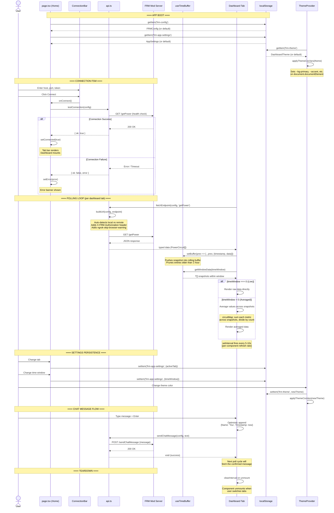

# Data Flow

This sequence diagram traces the full lifecycle of a connection and data poll — from the user clicking Connect through to a dashboard component rendering time-averaged data. It covers the connection FSM, polling loop, time-buffer accumulation, and localStorage persistence for config, settings, and theme.

