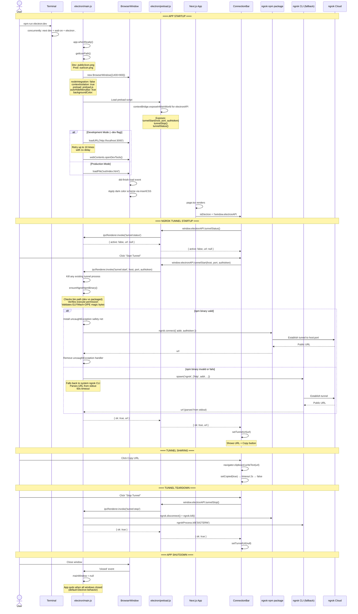

# Electron Integration

This sequence diagram covers the Electron desktop shell lifecycle: main process startup, BrowserWindow creation, Next.js loading (dev vs production), the `contextBridge` IPC channel for ngrok tunnel management, and tunnel start/stop/status flows.

