# State Management

This diagram covers all state architecture in Statusfactory: the four persistence hooks (`useConfig`, `useAppSettings`, `useTheme`/`ThemeProvider`, `useTimeBuffer`), the connection state machine, and how these pieces interact with `localStorage` and the dashboard components.

```mermaid
graph TD
    subgraph "localStorage"
        LS_CONFIG["frm-config<br/>{ host, port, password, refreshRate }"]
        LS_SETTINGS["frm-app-settings<br/>{ iconSize, mapIconScale,<br/>  activeTab, timeWindow,<br/>  mapVisibleLayers, themeMode }"]
        LS_THEME["frm-theme<br/>{ bgPrimary, bgSecondary, bgCard,<br/>  borderColor, textPrimary, textSecondary,<br/>  accent, accentHover,<br/>  success, danger, info, muted }"]
    end

    subgraph "useConfig Hook"
        CONFIG_STATE["useState: FRMConfig<br/>default: localhost:8080"]
        CONFIG_LOAD["useEffect (mount)<br/>JSON.parse(localStorage['frm-config'])<br/>merge with defaults"]
        CONFIG_SAVE["saveConfig(newConfig)<br/>1. setState(newConfig)<br/>2. localStorage.setItem(...)"]
        CONFIG_LOAD --> CONFIG_STATE
        CONFIG_STATE --> CONFIG_SAVE
    end

    subgraph "useAppSettings Hook"
        SETTINGS_STATE["useState: AppSettings<br/>default: DEFAULT_SETTINGS"]
        SETTINGS_LOAD["useEffect (mount)<br/>JSON.parse(localStorage['frm-app-settings'])<br/>merge with defaults"]
        SETTINGS_SAVE["saveSettings(partial)<br/>1. setState(prev => {...prev, ...partial})<br/>2. localStorage.setItem(...)"]
        SETTINGS_RESET["resetSettings()<br/>1. localStorage.removeItem(...)<br/>2. setState(DEFAULT_SETTINGS)"]
        SETTINGS_LOAD --> SETTINGS_STATE
        SETTINGS_STATE --> SETTINGS_SAVE
        SETTINGS_STATE --> SETTINGS_RESET
    end

    subgraph "useTheme / ThemeProvider"
        THEME_LOAD["useEffect (mount)<br/>1. Check frm-theme (custom colors)<br/>2. Fallback: check frm-app-settings.themeMode<br/>   'light' → LIGHT_THEME<br/>   else → DEFAULT_THEME"]
        THEME_STATE["useState: DashboardTheme"]
        THEME_APPLY["applyThemeCssVars(theme)<br/>Sets on document.documentElement:<br/>  --bg-primary, --bg-secondary,<br/>  --bg-card, --border-color,<br/>  --text-primary, --text-secondary,<br/>  --accent, --accent-hover,<br/>  --success, --danger, --info, --muted"]
        THEME_UPDATE["updateTheme(partial)<br/>1. setState(prev => {...prev, ...partial})<br/>2. localStorage.setItem('frm-theme', ...)<br/>3. applyThemeCssVars(next)"]
        THEME_RESET["resetTheme()<br/>1. localStorage.removeItem('frm-theme')<br/>2. setState(DEFAULT_THEME)<br/>3. applyThemeCssVars(DEFAULT_THEME)"]
        THEME_MOUNTED["mounted flag<br/>(prevents SSR flash)"]
        THEME_LOAD --> THEME_STATE
        THEME_STATE --> THEME_APPLY
        THEME_STATE --> THEME_UPDATE
        THEME_STATE --> THEME_RESET
        THEME_LOAD --> THEME_MOUNTED
        THEME_MOUNTED -->|"true → render children"| THEME_STATE
        THEME_MOUNTED -->|"false → return null"| THEME_STATE
    end

    subgraph "useTimeBuffer Hook"
        BUFFER_STATE["useState: TimedEntry<T>[]<br/>rolling buffer, max 1 hour"]
        BUFFER_PUSH["useEffect on data change<br/>if (data !== null):<br/>  push {timestamp: Date.now(), data}<br/>  prune entries > 1 hour old"]
        BUFFER_QUERY["getWindowData(windowMs)<br/>filter entries where<br/>  timestamp >= Date.now() - windowMs<br/>return data[]"]
        BUFFER_AVERAGE["getWindowAverage(windowMs, mapFn)<br/>getWindowData → reduce(sum) / count"]
        BUFFER_PUSH --> BUFFER_STATE
        BUFFER_STATE --> BUFFER_QUERY
        BUFFER_STATE --> BUFFER_AVERAGE
    end

    subgraph "Connection State Machine (page.tsx)"
        DISCONNECTED["Disconnected<br/>connected=false, error=null"]
        CONNECTING["Connecting<br/>connecting=true"]
        CONNECTED["Connected<br/>connected=true<br/>tabs + dashboards visible"]
        ERROR["Error<br/>connected=false<br/>error=message string"]

        DISCONNECTED -->|"handleConnect()<br/>testConnection(config)"| CONNECTING
        CONNECTING -->|"result.ok = true"| CONNECTED
        CONNECTING -->|"result.ok = false"| ERROR
        CONNECTED -->|"handleConfigChange()<br/>setConnected(false)"| DISCONNECTED
        ERROR -->|"handleConnect()"| CONNECTING
        ERROR -->|"handleConfigChange()"| DISCONNECTED
    end

    subgraph "Tab State (page.tsx)"
        TAB_STATE["useState: TabId<br/>default: 'power'<br/>13 possible values"]
        TAB_CHANGE["handleTabChange(tab)<br/>1. setActiveTab(tab)<br/>2. saveSettings({activeTab: tab})"]
        TAB_RESTORE["On boot after load:<br/>if settings.activeTab in TABS<br/>  setActiveTab(settings.activeTab)"]
        TAB_STATE --> TAB_CHANGE
        TAB_RESTORE --> TAB_STATE
    end

    subgraph "Time Window State (page.tsx)"
        TW_STATE["useState: TimeWindowMs<br/>default: 0 (Live)<br/>7 possible values"]
        TW_CHANGE["handleTimeWindowChange(tw)<br/>1. setTimeWindow(tw)<br/>2. saveSettings({timeWindow: tw})"]
        TW_RESTORE["On boot after load:<br/>setTimeWindow(settings.timeWindow)"]
        TW_STATE --> TW_CHANGE
        TW_RESTORE --> TW_STATE
    end

    subgraph "Per-Component Polling State"
        COMP_STATE["useState: data | null<br/>loading, error"]
        COMP_FETCH["useCallback: fetchData()<br/>fetchEndpoint(config, endpoint)<br/>setData / setError"]
        COMP_INTERVAL["useEffect<br/>fetchData() on mount<br/>setInterval(fetchData, rate)<br/>clearInterval on unmount"]
        COMP_INTERVAL --> COMP_FETCH
        COMP_FETCH --> COMP_STATE
        COMP_STATE --> BUFFER_PUSH
    end

    LS_CONFIG --- CONFIG_LOAD
    LS_CONFIG --- CONFIG_SAVE
    LS_SETTINGS --- SETTINGS_LOAD
    LS_SETTINGS --- SETTINGS_SAVE
    LS_SETTINGS --- SETTINGS_RESET
    LS_THEME --- THEME_LOAD
    LS_THEME --- THEME_UPDATE
    LS_THEME --- THEME_RESET
    THEME_LOAD -.->|"fallback read"| LS_SETTINGS

    classDef storage fill:#2d2d0e,stroke:#f4c542,color:#f0f0f0
    classDef hook fill:#1a0e2d,stroke:#9b59b6,color:#f0f0f0
    classDef fsm fill:#0a1628,stroke:#3498db,color:#f0f0f0
    classDef tabState fill:#16281a,stroke:#2ecc71,color:#f0f0f0
    classDef compState fill:#2d1f0e,stroke:#e6a720,color:#f0f0f0

    class LS_CONFIG,LS_SETTINGS,LS_THEME storage
    class CONFIG_STATE,CONFIG_LOAD,CONFIG_SAVE,SETTINGS_STATE,SETTINGS_LOAD,SETTINGS_SAVE,SETTINGS_RESET,THEME_LOAD,THEME_STATE,THEME_APPLY,THEME_UPDATE,THEME_RESET,THEME_MOUNTED,BUFFER_STATE,BUFFER_PUSH,BUFFER_QUERY,BUFFER_AVERAGE hook
    class DISCONNECTED,CONNECTING,CONNECTED,ERROR fsm
    class TAB_STATE,TAB_CHANGE,TAB_RESTORE,TW_STATE,TW_CHANGE,TW_RESTORE tabState
    class COMP_STATE,COMP_FETCH,COMP_INTERVAL compState
```

